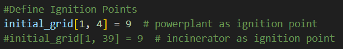
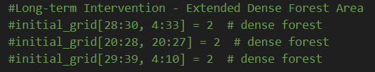

# COM 3524 Group Project - Forest Fire Simulation

This repository contains the adapted Cellular Automata (CA) model used to simulate wildfire spread across heterogenous terrain, based on the COM3524 "Bio-Inspired Computing" assignment brief.

This project investigates how fire spreads from two industrial ignition sources, a power plant and an incinerator, towards a nearby town, under different terrains such as dense forest, canyon, chapparal, and water.

## Prerequisites
To run the simulation, you need:

- [Python 3.8+](https://www.python.org/downloads/)
- NumPy
- CAPyle CA Simulator (provided in the module)
- `pip` (Python package manager for installing necessary dependencies)
- Git (to clone this repository)

## Running the Simulation (Using CAPlye GUI)

### 1. Launch the tools menu
Inside the COM3524 container, run:

```bash
python run_tool.py 
```
---

Once you run the command, the following menu should appear, allowing you to select which tool to launch.

<div style="display: flex; align-items: flex-start; gap: 1rem;">

  
</div>

  - The menu allows you to select from available tools.
  - Use the number keys (1–3) to choose the desired tool.  
  - Choose number 3 (CAPyle Tool) to open the CAPyle GUI.

### 2. Load the Wildfire Model

In the CAPyle interface;

- Go to File → Open

<div style="display: flex; align-items: flex-start; gap: 1rem;">

  
</div>

- Select the file: 

```bash
forest.py 
```

- Go to Simulation → Run Configuration

<div style="display: flex; align-items: flex-start; gap: 1rem;">

  
</div>

- Start the simulation by clicking the play button

### 3. Choosing the Ignition Scenario
The ignition point is controlled in **forest.py** inside the **setup()** function.

Both igntion scenarios (power plant and incinerator) are already defined.

To select which scenario to run, simply **uncomment** the ignition point you want to enable and **comment out** the other.

<div style="display: flex; align-items: flex-start; gap: 1rem;">

  
</div>

#### Power Plant Ignition (Scenario 1)
Ensure you have:

```bash
initial_grid[1, 4] = 9
```
This puts a burning cell near the power plant to start the wildfire spread towards town.

#### Incinerator Ignition (Scenario 2)
Ensure you have:

```bash
initial_grid[1, 39] = 9
```
This puts a burning cell near the incinerator to start the wildfire spread towards town.

### 4. Running Wind Scenarios

### 5. Running Intervention Scenarios

#### Short-Term Intervention - Aerial Water Drop

#### Long-Term Intervention - Extended Dense Forest
The modified initial grid with an extended dense forest is controlled in **forest.py** inside the **setup()** function.

The conditions of the modified grid is already defined.

To select this grid, simply **uncomment** the addition dense forest definitions.

<div style="display: flex; align-items: flex-start; gap: 1rem;">

  
</div>

### 6. Time-to-Town Measurement
After the simulation finished, the program automatically calculates:

**How many generations it takes for the fire to reach and burn the town**

This is detected by checking when any cell becomes state 13 (burned town)

Output appears in the terminal:

```bash
Time (generations) for fire to reach town: X 
```

## Author
Adlina Rusli
Gabriel Mazierski
Cailean Allway
Antoni Nikolak
